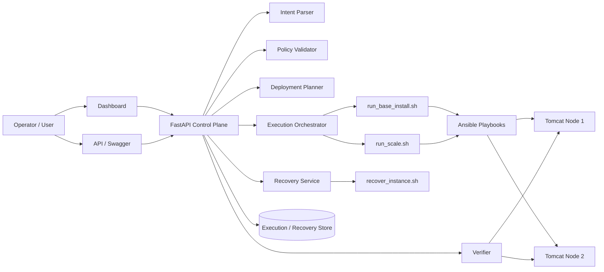
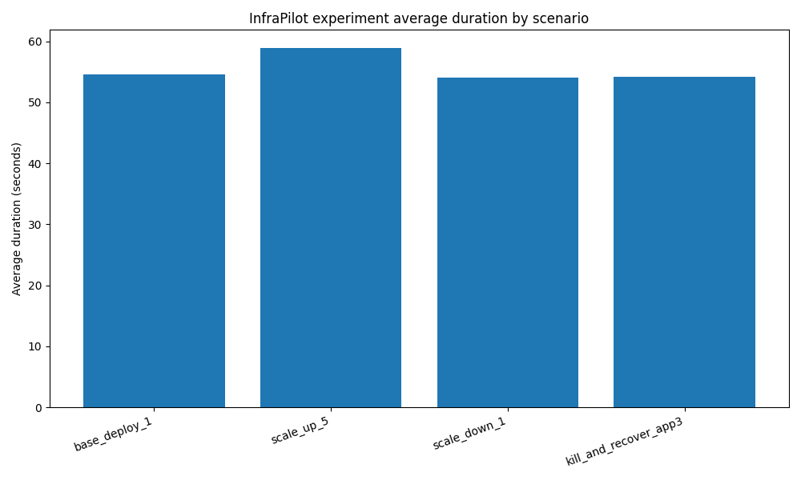
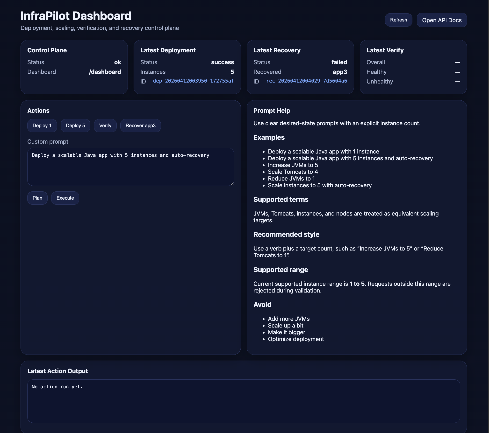

# InfraPilot

**InfraPilot is a natural-language control plane for Tomcat operations.**  
It lets an operator use plain-English commands to bring Tomcat instances up, scale them, verify runtime health, and trigger recovery workflows through a guarded automation layer.

Instead of manually stitching together scripts, playbooks, and host-level checks, InfraPilot provides a single prompt-driven interface that translates operator intent into validated, deterministic execution.

## Why InfraPilot

Modern infrastructure teams often have strong automation, but the operational experience is still fragmented. Routine lifecycle actions such as deployment, scaling, verification, and recovery typically require multiple tools, context switching, and knowledge of environment-specific commands.

InfraPilot simplifies that workflow by acting as a natural-language command surface for Java/Tomcat environments. It combines:

- natural-language intent parsing
- policy-based validation
- deterministic Ansible-backed execution
- runtime verification
- targeted recovery
- dashboard and API visibility

The result is a cleaner operator experience for managing Tomcat lifecycle actions with bounded, auditable behavior.

## What You Can Type

InfraPilot supports plain-English operational prompts such as:

- `Deploy a scalable Java app with 1 instance`
- `Deploy a scalable Java app with 5 instances and auto-recovery`
- `Increase JVMs to 5`
- `Scale Tomcats to 4`
- `Reduce JVMs to 1`

InfraPilot currently normalizes **JVMs**, **Tomcats**, **instances**, and **nodes** into the same operational model: **desired Tomcat instance count**.

## What It Does

InfraPilot turns natural-language requests into a controlled execution flow:

1. Parse operator intent
2. Normalize it into a structured deployment specification
3. Validate against supported policy and range limits
4. Execute deterministic deployment or scaling workflows
5. Verify runtime state
6. Persist execution history
7. Trigger targeted recovery when required

## Highlights

- Natural-language command interface for Tomcat lifecycle operations
- Guarded control path with explicit validation
- Deterministic execution instead of free-form runtime generation
- Desired-state scaling and reconciliation
- Health verification for deployed instances
- Targeted single-instance recovery workflow
- Lightweight dashboard and API control surface
- Repeatable testcase-driven evaluation

## Architecture



## Lab Topology

- **Fedora VM**: control plane
- **Ubuntu VMs**: Tomcat application nodes
- **Windows VM**: optional traffic generation and demo support

## API Endpoints

- `/intent/parse`
- `/spec/validate`
- `/deploy/plan`
- `/deploy/execute`
- `/deploy/status/{deployment_id}`
- `/deploy/history`
- `/deploy/verify`
- `/deploy/recover`
- `/deploy/recover/status/{recovery_id}`
- `/deploy/recover/history`
- `/dashboard`

## Evaluation Methodology

InfraPilot was evaluated using repeatable operational testcases:

- **TC01**: base deployment to 1 instance
- **TC02**: scale up to 5 instances
- **TC03**: scale down to 1 instance
- **TC04**: kill one instance and attempt targeted recovery

## Testcase Summary

| Scenario | Runs | Success Rate | Avg Duration (s) | Min (s) | Max (s) | Avg Unhealthy Count |
|---|---:|---:|---:|---:|---:|---:|
| base_deploy_1 | 100 | 100.0% | 51.47 | 36.0 | 249.0 | 1 |
| scale_up_5 | 100 | 100.0% | 51.66 | 36.0 | 299.0 | 5 |
| scale_down_1 | 100 | 100.0% | 45.93 | 34.0 | 137.0 | 1 |
| kill_and_recover_app3 | 100 | 100.0% | 57.24 | 39.0 | 329.0 | 5 |

## Interpretation

The testcase results show that the natural-language deployment, scale-up, and scale-down paths are stable across repeated runs. That result is still useful because it clearly separates:

- a working **natural-language command path for bringing Tomcats up and scaling them**
- an incomplete **recovery path** that still needs refinement

## Plots

Place the generated plot images under `testcase_results/plots/` and they will render in this README.

### Average Duration by Scenario



## Repository Structure

```text
InfraPilot/
  inventory/
  playbooks/
  scripts/
  templates/
  controller/
  testcases/
    run_all_testcases.sh
    tc01_scenario_base_deploy_1.sh
    tc02_scenario_scale_up_5.sh
    tc03_scenario_scale_down_1.sh
    tc04_scenario_kill_and_recover_app3.sh
    summarize_results.py
    generate_plots.py
    testcase_results/
```

## Demo Flow

1. Enter a natural-language command to bring Tomcats up
2. Scale to 5 instances using natural language
3. Verify healthy state
4. Kill `app3`
5. Re-run verification
6. Trigger recovery
7. Review testcase metrics and plots

## Current Scope

InfraPilot is intentionally bounded to preserve operational safety and auditability.

### Supported

- Natural-language commands for Tomcat lifecycle operations
- Java application deployment
- Tomcat runtime
- Instance-count scaling
- Verification and targeted recovery
- Guarded prompts with explicit desired state

### Not yet generalized

- Arbitrary infrastructure synthesis
- Multi-runtime orchestration
- Unbounded free-form operations
- Production-scale policy orchestration

## Future Work

- Improve targeted recovery reliability
- Extend policy and validation rules
- Add richer dashboard observability
- Expand runtime support beyond Tomcat
- Compare against manual operator workflows
- Strengthen paper-grade evaluation and reporting

## Positioning

InfraPilot demonstrates a practical pattern for combining:

- natural-language command input
- bounded intent normalization
- policy validation
- deterministic infrastructure automation
- runtime verification
- targeted recovery

It is best described as a **natural-language command prompt for bringing Tomcats up and managing their lifecycle safely**.

## Dashboard


